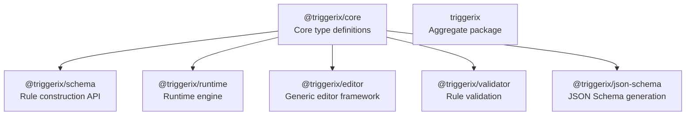
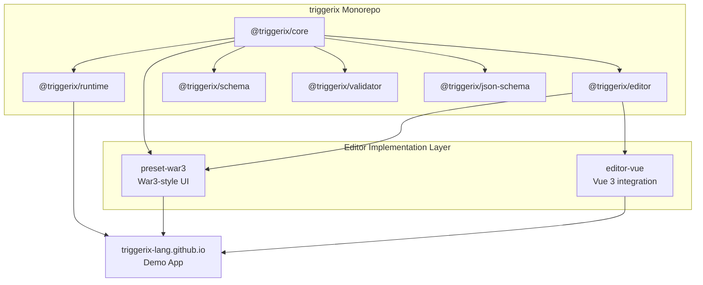
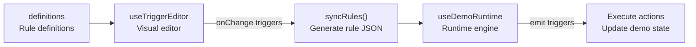
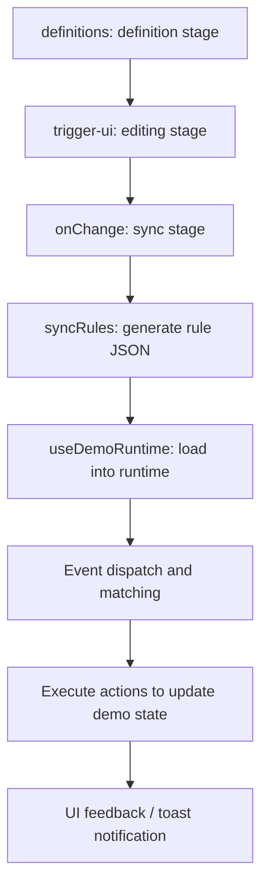

# Triggerix Ecosystem Architecture and Implementation

English | [中文](./README_CN.md)

## Table of Contents

- [Project Overview](#project-overview)
- [Core Concepts](#core-concepts)
- [Ecosystem Architecture](#ecosystem-architecture)
- [Demo Project Architecture](#demo-project-architecture)
- [Technology Stack Overview](#technology-stack-overview)
- [Key Design Decisions](#key-design-decisions)

## Project Overview

Triggerix is a complete **Event-Condition-Action (ECA) rule engine ecosystem** that can build and drive arbitrary interaction logic at runtime. It consists of several collaborating npm packages and applications, with the core design philosophy of representing rules as data, supporting visual editing, validation, and runtime execution.

This Demo project (triggerix-lang.github.io) is the official showcase site for Triggerix, demonstrating the full rule editing and execution flow.

### Vision

Triggerix is part of the application infrastructure for the AI era. We believe that future apps should be able to **generate interfaces precisely on demand**—where the structure, styling, and interaction events of components are dynamically produced by AI.

To make this possible, we decompose an application into three layers:

| Layer       | Project                     | Responsibility                                                                            | Analogy |
| ----------- | --------------------------- | ----------------------------------------------------------------------------------------- | ------- |
| Structure   | Component Library (planned) | Provides UI component skeletons with no preset behavior or styling                        | Bones   |
| Interaction | **Triggerix**               | Attaches interaction events to components, describing arbitrary interaction logic in JSON | Muscles |
| Style       | Skinix (planned)            | Attaches visual effects to components, describing appearance via JSON Schema              | Skin    |

**Example scenario:**

> The user says: "I'd like to change my avatar."
>
> The AI generates a card component—the current avatar on the left, the prompt text "Click to upload an image" on the right, and a confirm button below. The component's structure, styling, and interaction events are entirely produced by the AI based on semantics, with no manual coding required.

At the current stage, Triggerix has achieved the ability to describe arbitrary interaction events using JSON Schema and drive their execution at runtime.

### Related Projects

| Project                      | Type               | Description                                                                   |
| ---------------------------- | ------------------ | ----------------------------------------------------------------------------- |
| triggerix                    | Monorepo           | Core open-source library, containing 7 npm packages                           |
| triggerix-editor-preset-war3 | Standalone package | War3-style editor preset (visual editor implementation)                       |
| triggerix-editor-vue         | Standalone package | Vue 3 editor integration library (composables and utilities)                  |
| triggerix-lang.github.io     | Demo app           | Official showcase site demonstrating the full rule editing and execution flow |

## Core Concepts

### Rule Model

```typescript
interface Rule {
  id: string
  event: { type: string; payload?: Record<string, unknown> }
  conditions?: ConditionGroup
  actions: ActionNode[]
}
```

### How the Editor Works

The editor is inspired by the trigger panel of the War3 map editor. Each rule contains three sections:

- **Event**: the trigger condition, e.g. "button is clicked"
- **Condition**: optional filter conditions
- **Action**: the sequence of operations to execute

Templates use the `${slot}` syntax to define slots, for example:

```text
${button} is clicked
```

Users click on a slot to pick a tool and fill in a value via a modal.

### Tool System

The tool system defines how users provide values for slots:

- **Leaf Tool**: direct input, such as a text field, number field, or dropdown
- **Composite Tool**: a nested structure containing child slots

Each tool has a `resolve` function that converts user input into a value the rule engine can understand.

## Ecosystem Architecture

### Core Packages

triggerix is a pnpm workspace monorepo consisting of 7 collaborating npm packages, with the following dependency relationships:



Details of each package:

| Package                  | Version | Responsibility                                   | Key Exports                                                                                                  |
| ------------------------ | ------- | ------------------------------------------------ | ------------------------------------------------------------------------------------------------------------ |
| `@triggerix/core`        | v0.0.3  | Type definitions and interface specifications    | Event / Condition / Action / Rule / Expression / ActionNode                                                  |
| `@triggerix/schema`      | v0.0.3  | Rule construction API                            | defineEvent / defineAction / defineCondition / defineRule / expr / sequence / parallel / tryCatch / actionIf |
| `@triggerix/runtime`     | v0.0.3  | Rule engine execution                            | createRuntime / event dispatch / evaluateCondition / executeActionNode / ExpressionEvaluator                 |
| `@triggerix/editor`      | v0.0.3  | Generic editor abstraction (framework-agnostic)  | Editor interface / descriptor system / observable state                                                      |
| `@triggerix/validator`   | v0.0.3  | Rule validation                                  | Rule structure and type checks                                                                               |
| `@triggerix/json-schema` | v0.0.3  | JSON Schema generation                           | Generates JSON Schema from types                                                                             |
| `triggerix`              | v0.0.3  | Aggregate package, re-exporting all of the above | —                                                                                                            |

### Editor Implementation Layer

#### triggerix-editor-preset-war3

A War3-style editor preset that implements concrete visual editing logic on top of the `@triggerix/editor` framework.

**Core features:**

- Tool system (leaf tools / composite tools)
- Slot system (`${slot}` placeholders in templates)
- Template rendering
- Serialization (`toRule`)

**Tool system design:**

- **Leaf tools**: atomic inputs (text / number / select)
- **Composite tools**: may contain child slots (nested structure)
- **resolve function**: converts user input into a rule value

#### triggerix-editor-vue

A library that integrates `@triggerix/editor` with Vue 3's reactivity system, providing Vue composables.

**Core capabilities:**

- Peer dependency: `vue ^3.5.0`
- Dependency: `@triggerix/editor (^0.0.4)`
- Provides a Vue 3 composables integration layer

### Dependency Topology



## Demo Project Architecture

### Directory Structure

```
src/
├── pages/                    # Demo pages (file-based routing)
│   ├── index.vue             # Home page
│   └── demo/
│       ├── button-click.vue        # Button click event demo
│       ├── button-modify-input.vue # Button modifying input demo
│       ├── carousel-linkage.vue    # Carousel linkage demo
│       ├── carousel-switch.vue     # Carousel switching demo
│       └── input-focus.vue         # Input focus demo
├── definitions/              # Rule definitions (describing each demo's trigger rules)
│   ├── button-click.ts
│   ├── button-modify-input.ts
│   ├── carousel-linkage.ts
│   ├── carousel-switch.ts
│   ├── input-focus.ts
│   ├── helpers.ts
│   ├── shared-tools.ts
│   ├── shared-values.ts
│   └── code-snippets/        # Code display snippets
├── trigger-ui/               # Visual editor UI components
│   ├── components/
│   │   ├── TriggerEditor.vue      # Main editor panel
│   │   ├── TriggerSection.vue     # Section (event / condition / action)
│   │   ├── TriggerTabs.vue        # Multi-trigger tab switcher
│   │   ├── TriggerItem.vue        # Single item renderer
│   │   ├── ItemEditorModal.vue    # Type-selection modal
│   │   ├── SlotFillModal.vue      # Slot-fill modal
│   │   ├── SegmentRenderer.vue    # Template renderer
│   │   ├── SlotChip.vue           # Slot visual display
│   │   ├── ToolInput.vue          # Tool input control
│   │   └── Modal.vue              # Generic modal
│   ├── composables/
│   │   ├── useTriggerEditor.ts    # Editor core logic
│   │   └── useModal.ts            # Modal management
│   └── index.ts
├── composables/
│   ├── useDemoRuntime.ts     # Runtime management
│   └── useCodePanel.ts       # Code panel management
├── components/               # Generic UI components
│   ├── playground/
│   │   ├── PlayButton.vue
│   │   ├── PlayCarousel.vue
│   │   └── PlayInput.vue
│   ├── code-viewer/
│   │   ├── CodeViewer.vue
│   │   └── CodeTabs.vue
│   └── DemoToast.vue
└── layouts/
    └── DemoLayout.vue        # Demo page layout
```

### Core Data Flow



### Workflow



1. **Definition stage**: `definitions/` defines the events, actions, tools, and rule templates for each demo.
2. **Editing stage**: `trigger-ui/` provides a visual editor where users interactively edit trigger rules.
3. **Sync stage**: editor changes flow through `onChange` → `syncRules()` to produce rule JSON.
4. **Execution stage**: `useDemoRuntime` loads the rules into `@triggerix/runtime`, which automatically matches and executes them when events are dispatched.

## Technology Stack Overview

| Layer                 | Core Package                   | Responsibility                                |
| --------------------- | ------------------------------ | --------------------------------------------- |
| Data                  | `@triggerix/core`              | Type definitions and interface specifications |
| Construction          | `@triggerix/schema`            | Rule construction API                         |
| Validation            | `@triggerix/validator`         | Rule validation                               |
| Runtime               | `@triggerix/runtime`           | Rule engine execution                         |
| Editor framework      | `@triggerix/editor`            | Generic editor abstraction                    |
| Visual implementation | `triggerix-editor-preset-war3` | War3-style editor UI implementation           |
| Vue integration       | `triggerix-editor-vue`         | Vue composables                               |
| Showcase app          | `triggerix-lang.github.io`     | Demo website                                  |

## Key Design Decisions

1. **Framework-agnostic design**: `@triggerix/editor` defines generic interfaces, so War3Editor, Form Editor, and Workflow Editor can each be implemented independently.
2. **Descriptor system**: the editor never manipulates rule JSON directly; it exposes UI views through a descriptor interface.
3. **Multi-trigger isolation**: each trigger has its own War3Editor instance, with fully isolated editing state.
4. **Source condition injection**: source conditions enable precise event matching and routing.
5. **Instant synchronization**: editor changes → `onChange` triggers → `syncRules()` regenerates the rules → pushed to the runtime.
