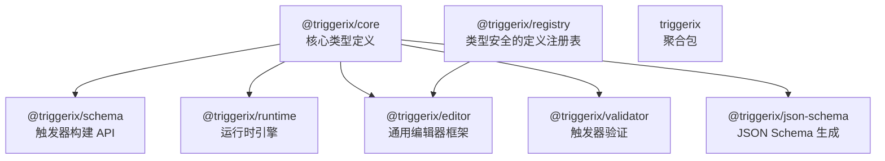
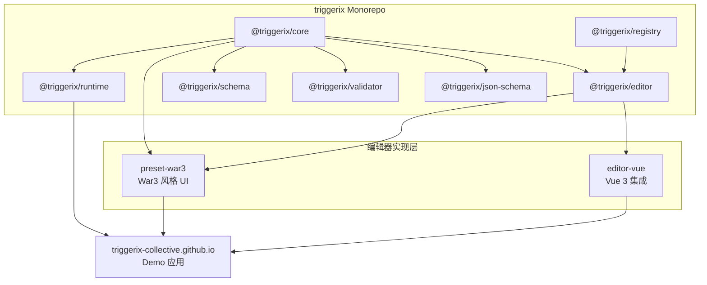
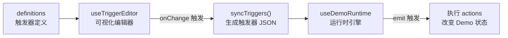
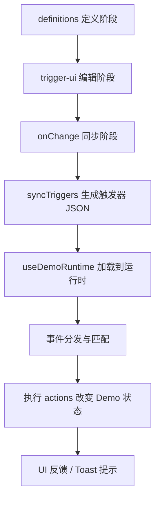

# Triggerix 生态架构与实现

[English](./README.md) | 中文

## 目录

- [项目概览](#项目概览)
- [核心概念](#核心概念)
- [生态架构](#生态架构)
- [Demo 项目架构](#demo-项目架构)
- [技术栈总览](#技术栈总览)
- [关键设计决策](#关键设计决策)

## 项目概览

Triggerix 是一个完整的**事件-条件-动作 (ECA) 触发器引擎生态**，能够在运行时构建并驱动任意交互逻辑。由多个协作的 npm 包和应用组成，核心设计理念是：将触发器表示为数据，支持可视化编辑、验证和运行时执行。

本 Demo 项目 (triggerix-collective.github.io) 是 Triggerix 的官方演示网站，展示完整的触发器编辑与执行流程。

### 愿景

Triggerix 是面向 AI 时代的应用基础设施的一部分。我们认为未来的 APP 应该能够**根据用户需求精准生成界面**——组件的结构、样式、交互事件完全由 AI 动态生成。

为实现这一目标，我们将应用拆解为三层：

| 层级   | 项目             | 职责                                            | 类比 |
| ------ | ---------------- | ----------------------------------------------- | ---- |
| 结构层 | 组件库（规划中） | 提供 UI 组件框架，无预设行为和样式              | 骨骼 |
| 交互层 | **Triggerix**    | 为组件附着交互事件，用 JSON 描述任意交互逻辑    | 肌肉 |
| 样式层 | Skinix（规划中） | 为组件附着样式效果，用 JSON Schema 描述视觉表现 | 皮肤 |

**场景示例：**

> 用户说：「我想修改头像」
>
> AI 生成一个卡片组件——左侧为当前头像，右侧为提示文字"点击上传图片"，下方一个确认按钮。组件的结构、样式、交互事件完全由 AI 根据语义生成，无需人工编码。

当前阶段，Triggerix 已实现用 JSON Schema 描述任意交互事件，并在运行时驱动执行。

### 相关项目

| 项目                           | 类型      | 描述                                         |
| ------------------------------ | --------- | -------------------------------------------- |
| triggerix                      | Monorepo  | 核心开源库，包含多个 npm 包                  |
| triggerix-editor-preset-war3   | 独立包    | War3 风格的编辑器预设（可视化编辑器实现）    |
| triggerix-editor-vue           | 独立包    | Vue 3 编辑器集成库（composables 和工具函数） |
| triggerix-collective.github.io | Demo 应用 | 官方演示网站，展示完整的触发器编辑和执行流程 |

## 核心概念

### 触发器模型 (Trigger)

```typescript
interface Trigger {
  id: string
  event: { type: string; payload?: Record<string, unknown> }
  conditions?: ConditionGroup
  actions: ActionNode[]
}
```

### 编辑器工作方式

编辑器基于 War3 地图编辑器的触发器面板设计，每个触发器包含三个区域：

- **事件 (Event)**：触发条件，如"按钮被点击"
- **条件 (Condition)**：可选的过滤条件
- **动作 (Action)**：要执行的操作序列

模板使用 `${slot}` 语法定义槽位，如：

```text
${button} 被点击
```

用户通过点击槽位，在弹窗中选择工具和填写值。

### 工具系统 (Tool System)

工具系统定义了用户如何为槽位提供值：

- **叶子工具 (Leaf Tool)**：直接输入，如文本框、数字框、下拉选择
- **复合工具 (Composite Tool)**：包含子槽位的嵌套结构

每个工具有一个 `resolve` 函数，将用户输入转换为触发器引擎可理解的值。

## 生态架构

### 核心包

triggerix 是一个 pnpm workspace monorepo，包含多个相互协作的 npm 包，包之间的依赖关系如下：



各包详细说明：

| 包名                     | 职责                                         | 关键导出                                                                                                        |
| ------------------------ | -------------------------------------------- | --------------------------------------------------------------------------------------------------------------- |
| `@triggerix/core`        | 类型定义、接口规范                           | Event / Condition / Action / Trigger / Expression / ActionNode                                                  |
| `@triggerix/schema`      | 触发器构建 API                               | defineEvent / defineAction / defineCondition / defineTrigger / expr / sequence / parallel / tryCatch / actionIf |
| `@triggerix/runtime`     | 触发器引擎执行                               | createRuntime / 事件分发 / evaluateCondition / executeActionNode / ExpressionEvaluator                          |
| `@triggerix/editor`      | 通用编辑器抽象（框架无关）                   | Editor 接口 / 描述符系统 / 可观察状态                                                                           |
| `@triggerix/validator`   | 触发器验证                                   | 触发器结构与类型校验                                                                                            |
| `@triggerix/json-schema` | JSON Schema 生成                             | 由类型生成 JSON Schema                                                                                          |
| `@triggerix/registry`    | 类型安全的 event/action/condition 定义注册表 | BaseRegistry / BaseItemDef                                                                                      |
| `triggerix`              | 聚合包，重新导出核心数据/构建/运行子包       | —                                                                                                               |

### 编辑器实现层

#### triggerix-editor-preset-war3

War3 风格的编辑器预设，基于 `@triggerix/editor` 框架实现具体的可视化编辑逻辑。

**核心功能：**

- 工具系统（叶子工具 / 复合工具）
- 槽位系统（模板中的 `${slot}` 占位符）
- 模板渲染
- 序列化（`toTrigger`）

**工具系统设计：**

- **叶子工具**：原子输入（text / number / select）
- **复合工具**：可包含子槽位（嵌套结构）
- **resolve 函数**：将用户输入转换为触发器值

#### triggerix-editor-vue

将 `@triggerix/editor` 与 Vue 3 响应式系统集成的库，提供 Vue composables。

**核心能力：**

- 对等依赖：Vue 3（推荐最新稳定版）
- 依赖：`@triggerix/editor`
- 提供 Vue 3 composables 集成层

### 依赖拓扑



## Demo 项目架构

### 目录结构

```
src/
├── pages/                    # Demo 页面（文件路由）
│   ├── index.vue             # 首页
│   └── demo/
│       ├── button-click.vue        # 按钮点击事件演示
│       ├── button-modify-input.vue # 按钮修改输入框演示
│       ├── carousel-linkage.vue    # 轮播联动演示
│       ├── carousel-switch.vue     # 轮播切换演示
│       └── input-focus.vue         # 输入框聚焦演示
├── definitions/              # 触发器定义（描述 Demo 的触发器）
│   ├── button-click.ts
│   ├── button-modify-input.ts
│   ├── carousel-linkage.ts
│   ├── carousel-switch.ts
│   ├── input-focus.ts
│   ├── helpers.ts
│   ├── shared-tools.ts
│   ├── shared-values.ts
│   └── code-snippets/        # 代码展示片段
├── trigger-ui/               # 可视化编辑器 UI 组件
│   ├── components/
│   │   ├── TriggerEditor.vue      # 主编辑面板
│   │   ├── TriggerSection.vue     # 区域（事件/条件/动作）
│   │   ├── TriggerTabs.vue        # 多触发器 Tab 切换
│   │   ├── TriggerItem.vue        # 单条目渲染
│   │   ├── ItemEditorModal.vue    # 类型选择弹窗
│   │   ├── SlotFillModal.vue      # 槽位填充弹窗
│   │   ├── SegmentRenderer.vue    # 模板渲染器
│   │   ├── SlotChip.vue           # 槽位可视化显示
│   │   ├── ToolInput.vue          # 工具输入控件
│   │   └── Modal.vue              # 通用弹窗
│   ├── composables/
│   │   ├── useTriggerEditor.ts    # 编辑器核心逻辑
│   │   └── useModal.ts            # 弹窗管理
│   └── index.ts
├── composables/
│   ├── useDemoRuntime.ts     # 运行时管理
│   └── useCodePanel.ts       # 代码面板管理
├── components/               # 通用 UI 组件
│   ├── playground/
│   │   ├── PlayButton.vue
│   │   ├── PlayCarousel.vue
│   │   └── PlayInput.vue
│   ├── code-viewer/
│   │   ├── CodeViewer.vue
│   │   └── CodeTabs.vue
│   └── DemoToast.vue
└── layouts/
    └── DemoLayout.vue        # Demo 页面布局
```

### 核心数据流



### 工作流程



1. **定义阶段**：`definitions/` 中定义每个 Demo 的事件、动作、工具、触发器模板
2. **编辑阶段**：`trigger-ui/` 提供可视化编辑器，用户可交互编辑触发器
3. **同步阶段**：编辑器变更通过 `onChange` → `syncTriggers()` 生成触发器 JSON
4. **执行阶段**：`useDemoRuntime` 将触发器加载到 `@triggerix/runtime`，分发事件时自动匹配和执行

## 技术栈总览

| 层级     | 核心包                           | 职责                |
| -------- | -------------------------------- | ------------------- |
| 数据层   | `@triggerix/core`                | 类型定义、接口规范  |
| 构建层   | `@triggerix/schema`              | 触发器构建 API      |
| 验证层   | `@triggerix/validator`           | 触发器验证          |
| 运行层   | `@triggerix/runtime`             | 触发器引擎执行      |
| 编辑框架 | `@triggerix/editor`              | 通用编辑器抽象      |
| 可视实现 | `triggerix-editor-preset-war3`   | War3 编辑器 UI 实现 |
| Vue 集成 | `triggerix-editor-vue`           | Vue composables     |
| 示范应用 | `triggerix-collective.github.io` | Demo 网站           |

## 关键设计决策

1. **框架无关设计**：`@triggerix/editor` 定义通用接口，War3Editor、Form Editor、Workflow Editor 都可独立实现
2. **描述符系统**：编辑器不直接操作触发器 JSON，通过描述符接口暴露 UI 视图
3. **多 Trigger 隔离**：每个 trigger 独立的 War3Editor 实例，编辑状态完全隔离
4. **source 条件注入**：通过 source 条件实现事件精准匹配和分流
5. **即时同步**：编辑器变更 → `onChange` 触发 → `syncTriggers()` 重新生成触发器 → 推送到运行时
